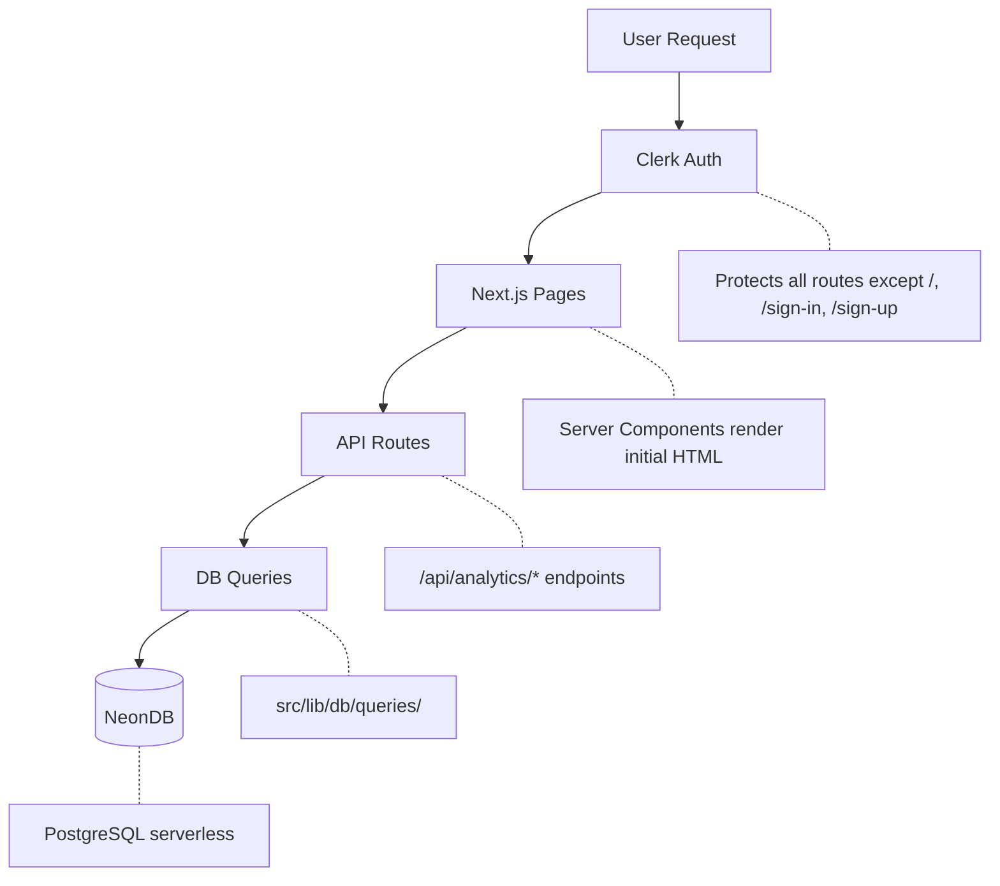
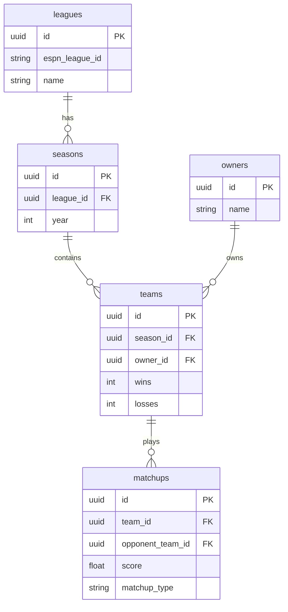

# Architecture

Technical architecture reference for FF Data.

## Overview

FF Data is a Next.js 16.1 application that provides analytics for historical ESPN fantasy football data. The app uses server-side rendering for initial loads and client-side data fetching (via TanStack Query) for interactive features.

## Data Flow



## Component Hierarchy

```
RootLayout (src/app/layout.tsx)
├── ClerkProvider
│   └── QueryClientProvider
│
├── Public Routes
│   ├── / (Landing)
│   ├── /sign-in
│   └── /sign-up
│
└── (dashboard)/Layout (src/app/(dashboard)/layout.tsx)
    ├── Header
    ├── Main Content
    │   ├── /standings
    │   │   ├── StandingsFilters
    │   │   └── StandingsTable
    │   │
    │   └── /analytics
    │       └── AnalyticsTabs
    │           ├── HallOfFame
    │           ├── Playoffs
    │           ├── H2HMatrix
    │           ├── MatchupRecords
    │           ├── WeeklyRecords
    │           └── RivalryView
    │
    └── Footer
```

## Database Relationships



### Tables

| Table      | Purpose                                | Key Fields                                                   |
| ---------- | -------------------------------------- | ------------------------------------------------------------ |
| `leagues`  | ESPN league info                       | `id`, `espn_league_id`, `name`                               |
| `owners`   | Human players (persist across seasons) | `id`, `name`                                                 |
| `seasons`  | League years                           | `id`, `league_id`, `year`                                    |
| `teams`    | Season-specific team data              | `id`, `season_id`, `owner_id`, `wins`, `losses`              |
| `matchups` | Week-by-week results                   | `id`, `team_id`, `opponent_team_id`, `score`, `matchup_type` |

### Matchup Types

- `regular` - Regular season game
- `playoff` - Playoff game
- `championship` - Championship game
- `consolation` - Consolation bracket
- `sacko` - Last place game

## State Management

| Type         | Solution       | Location                         |
| ------------ | -------------- | -------------------------------- |
| Server State | TanStack Query | `src/lib/hooks/use-analytics.ts` |
| URL State    | Search params  | Tab navigation in analytics      |
| Local State  | React hooks    | Component-level UI state         |

### Query Cache Configuration

```typescript
STALE_TIME = 30 * 60 * 1000; // 30 minutes
GC_TIME = 60 * 60 * 1000; // 60 minutes
```

### Query Key Factory

```typescript
analyticsKeys = {
	all: ['analytics'],
	hallOfFame: () => [...analyticsKeys.all, 'hall-of-fame'],
	matchups: () => [...analyticsKeys.all, 'matchups'],
	rivalry: (owner1Id, owner2Id) => [...analyticsKeys.all, 'rivalry', owner1Id, owner2Id],
	playoffs: () => [...analyticsKeys.all, 'playoffs'],
};
```

## API Endpoints

All endpoints require Clerk authentication.

### GET /api/analytics/hall-of-fame

Returns championship and sacko records.

**Response:**

```json
{
	"championships": [{ "year": 2023, "ownerName": "...", "teamName": "..." }],
	"sackos": [{ "year": 2023, "ownerName": "...", "teamName": "..." }],
	"ownerStats": [{ "ownerId": "...", "championships": 2, "sackos": 1 }]
}
```

### GET /api/analytics/matchups

Returns H2H records, blowouts, close games, and weekly scores.

**Response:**

```json
{
  "hasMatchupData": true,
  "h2hRecords": [{ "owner1Id": "...", "owner2Id": "...", "wins": 5, "losses": 3 }],
  "blowouts": [{ "year": 2023, "week": 1, "margin": 80.5, ... }],
  "closeGames": [{ "year": 2023, "week": 1, "margin": 0.5, ... }],
  "highScores": [{ "year": 2023, "week": 1, "score": 200.5, ... }],
  "lowScores": [{ "year": 2023, "week": 1, "score": 50.5, ... }],
  "owners": [{ "id": "...", "name": "..." }]
}
```

### GET /api/analytics/playoffs

Returns playoff leaderboard and records.

**Response:**

```json
{
  "hasPlayoffData": true,
  "leaderboard": [{ "ownerId": "...", "appearances": 5, "wins": 10 }],
  "championshipGames": [...],
  "blowouts": [...],
  "closeGames": [...],
  "highScores": [...],
  "lowScores": [...],
  "performers": [...],
  "cinderellas": [...],
  "droughts": [...],
  "heartbreakers": [...],
  "dynasties": [...],
  "clutchRatings": [...]
}
```

### GET /api/analytics/rivalry

Returns head-to-head stats between two owners.

**Query params:** `owner1Id`, `owner2Id`

**Response:**

```json
{
  "owner1": { "id": "...", "name": "...", "wins": 5 },
  "owner2": { "id": "...", "name": "...", "wins": 3 },
  "matchups": [...]
}
```
